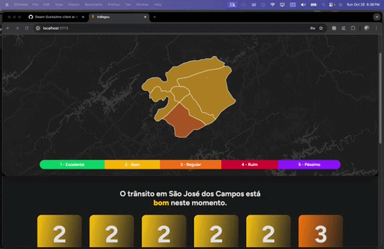
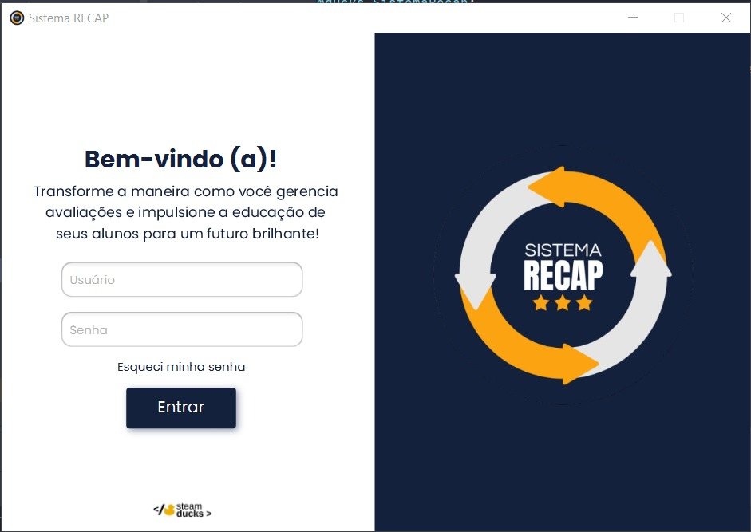
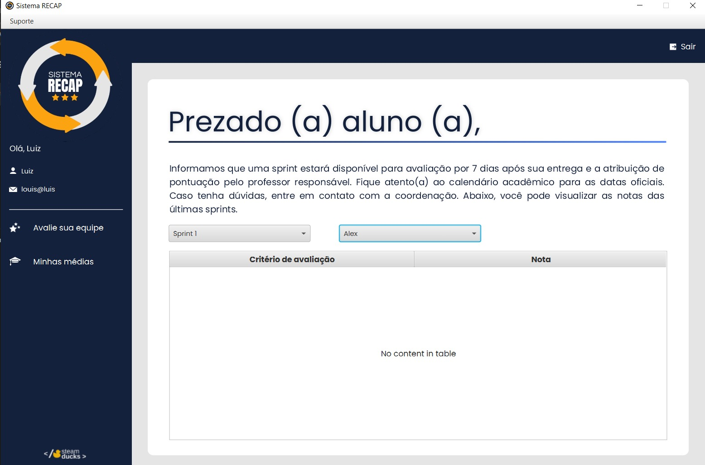
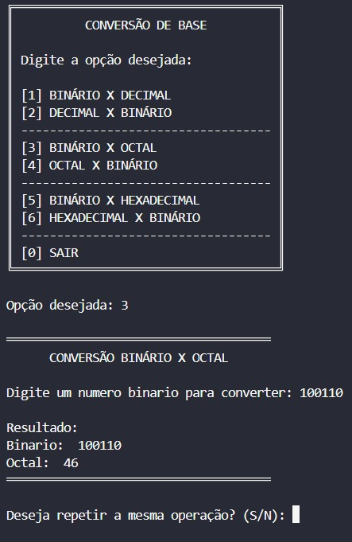

<p align="center">
  
</p>


<div style="margin-right: 220px;">

## Introdução

<div style="text-align: justify;">
Olá!
Meu nome é Isabelly, tenho 20 anos, sou estudante de Banco de Dados pela FATEC Jessen Vidal, de São José dos Campos, e atualmente estagiária de análise de dados na Ericsson.  

Minha trajetória na área de desenvolvimento começou no 1º semestre de 2024, e desde então venho adquirindo experiência nos diferentes campos que envolvem softwares estruturados. No meu dia a dia, é comum trabalhar com Python, Java, Docker e demais soluções de gerenciamento para armazenamento, consulta e organização de informações.  

Nos meus planos futuros, busco me aprofundar em back-end, criando sistemas eficientes, com código confiável o suficiente para sobreviver aos próximos releases; ou pelo menos até a próxima reunião de deploy. 
</div>

<div style="clear: both;"></div>

## Contato
* [LinkedIn](https://www.linkedin.com/in/isabelly-rdgs/)

## Meus Projetos

<details>
  <summary><strong>2025-1</strong></summary>

Em parceria com a empresa Altave, foi desenvolvido um sistema web para monitoramento de funcionários de empresas terceiras em áreas de manutenção. O sistema foi pensado a fim de permitir o cadastro de empresas e profissionais, incluindo fotos, e oferecendo uma filtragem de informações completa (por data, empresa e profissional). É possível visualização de dados de forma gráfica em um dashboard interativo, bem como extrair relatórios detalhados para análise de desempenho e controle de horas trabalhadas.

O projeto contou com uma API para consumo de dados e uma modelagem de banco de dados relacional eficiente, garantindo integridade e organização das informações. O design do front-end é minimalista e intuitivo, facilitando a navegação e o uso diário do sistema. Além disso, o sistema possui funcionalidades de gestão de acesso, permitindo que usuários se autentiquem por e-mail e senha, e registra um histórico de alterações realizadas nos pontos, assegurando transparência e controle das informações por meio de controle de acesso baseado em papéis (RBAC). Também há suporte à criação de cargos e definição de pagamentos com base nas horas trabalhadas, integrando todas as necessidades de monitoramento e gestão de funcionários terceirizados em um único ambiente digital.

<h1 align="center"> Pontual </h1>


<div align="center">
  
</div>
<br><br> 

<p align="center">
  <a href="https://github.com/Steam-Ducks/point-system" target="_blank">
    
  </a>
</p>

<br><br>

#### Tecnologias Utilizadas

<div align="center">
  
[](https://skillicons.dev)

</div>


#### Contribuições Pessoais
Atuei como Scrum Master, coordenando reuniões diárias e de planejamento (daily/planning) e alinhando expectativas entre Product Owner, equipe e stakeholders, garantindo o fluxo contínuo do projeto. Além disso, acompanhei o roteiro de desenvolvimento, a manutenção do repositório e a produtividade da equipe por meio do Jira, identificando pontos de melhoria e promovendo soluções em cima da metodologia ágil SCRUM.

Contribuí com a implementação de testes unitários em Java para nossas controllers (Employee, Company, Dashboard, Auth, Position, TimeRecords e User), assegurando a qualidade e cobertura do backend. Minha participação nos merges de pull requests foi, principalmente, na análise e validação do código garantindo que as funcionalidades fossem integradas de forma consistente e no conjunto da equipe como um todo. 

<details>
  <summary>1. Configuração de Dependências</summary>

  ## H2 

**pom.xml:**
```			<scope>runtime</scope>
			<optional>true</optional>
		</dependency>
		<dependency>
			<groupId>com.h2database</groupId>
			<artifactId>h2</artifactId>
			<version>2.2.224</version>
			<scope>runtime</scope>
		</dependency>
		<dependency>
			<groupId>org.projectlombok</groupId>
			<artifactId>lombok</artifactId>
```


**point-system/src/test/java/pointsystem/integrationPointSystemApplicationTests.java:**
```
package pointsystem.integration;

import org.junit.jupiter.api.Test;
import org.springframework.boot.test.autoconfigure.orm.jpa.DataJpaTest;
import org.springframework.boot.test.context.SpringBootTest;
import org.springframework.test.context.ActiveProfiles;

@DataJpaTest
@ActiveProfiles("test")
@SpringBootTest
class PointSystemApplicationTests {
```

**point-system/src/test/resources/application-test.properties:**
```
# Habilita o console web do H2
spring.h2.console.enabled=true
spring.h2.console.path=/h2-console

# Configuração do datasource para H2
spring.datasource.url=jdbc:h2:mem:pointdb
spring.datasource.driverClassName=org.h2.Driver
spring.datasource.username=sa
spring.datasource.password=

# JPA (opcional, ajusta conforme sua necessidade)
spring.jpa.database-platform=org.hibernate.dialect.H2Dialect
spring.jpa.hibernate.ddl-auto=update
```

</details>

<details>
  <summary>2. Testes</summary>

  ## Exemplo de Testes de Unidade

```
package pointsystem.unit.controller;

import org.junit.jupiter.api.BeforeEach;
import org.junit.jupiter.api.Test;
import org.mockito.*;
import org.springframework.http.HttpStatus;
import org.springframework.http.ResponseEntity;
import pointsystem.controller.UserController;
import pointsystem.dto.user.UserDto;
import pointsystem.service.UserService;

import java.util.Arrays;
import java.util.List;
import java.util.Map;

import static org.junit.jupiter.api.Assertions.*;
import static org.mockito.Mockito.*;

class UserControllerTest {

    @InjectMocks
    private UserController userController;

    @Mock
    private UserService userService;

    private AutoCloseable mocks;

    @BeforeEach
    void setUp() {
        mocks = MockitoAnnotations.openMocks(this);
    }

    @Test
    void testCreateUserSuccess() {
        UserDto dto = new UserDto();
        when(userService.createUser(dto)).thenReturn(10);

        ResponseEntity<?> response = userController.createUser(dto);

        assertEquals(HttpStatus.CREATED, response.getStatusCode());
        assertEquals(Map.of("id", 10), response.getBody());
        verify(userService).createUser(dto);
    }

    @Test
    void testCreateUserBadRequest() {
        UserDto dto = new UserDto();
        when(userService.createUser(dto)).thenThrow(new IllegalArgumentException("Dados inválidos"));

        ResponseEntity<?> response = userController.createUser(dto);

        assertEquals(HttpStatus.BAD_REQUEST, response.getStatusCode());
        assertEquals(Map.of("message", "Dados inválidos"), response.getBody());
    }

    @Test
    void testCreateUserInternalServerError() {
        UserDto dto = new UserDto();
        when(userService.createUser(dto)).thenThrow(new RuntimeException());

        ResponseEntity<?> response = userController.createUser(dto);

        assertEquals(HttpStatus.INTERNAL_SERVER_ERROR, response.getStatusCode());
        assertEquals(Map.of("message", "Erro ao cadastrar o Usuario. tente novamente"), response.getBody());
    }

    @Test
    void testGetAllUsers() {
        List<UserDto> users = Arrays.asList(new UserDto(), new UserDto());
        when(userService.getAllUsers()).thenReturn(users);

        ResponseEntity<List<UserDto>> response = userController.getAllUsers();

        assertEquals(HttpStatus.OK, response.getStatusCode());
        assertEquals(users, response.getBody());
    }

    @Test
    void testGetUserByIdFound() {
        UserDto user = new UserDto();
        when(userService.getUserById(1)).thenReturn(user);

        ResponseEntity<UserDto> response = userController.getUserById(1);

        assertEquals(HttpStatus.OK, response.getStatusCode());
        assertEquals(user, response.getBody());
    }

    @Test
    void testGetUserByIdNotFound() {
        when(userService.getUserById(1)).thenReturn(null);

        ResponseEntity<UserDto> response = userController.getUserById(1);

        assertEquals(HttpStatus.NOT_FOUND, response.getStatusCode());
        assertNull(response.getBody());
    }

    @Test
    void testUpdateUser() {
        UserDto dto = new UserDto();

        ResponseEntity<Void> response = userController.updateUser(1, dto);

        assertEquals(HttpStatus.NO_CONTENT, response.getStatusCode());
        verify(userService).updateUserById(1, dto);
    }
}
```
</details>


#### Hard Skills
* **Java & Spring Boot:** desenvolvimento de controllers, serviços e integração com banco de dados;

* **JUnit & Testes Unitários/Integração:** criação de testes abrangentes para múltiplos módulos do backend;

* **Git & GitHub:** gerenciamento de branches, merges, pull requests e manutenção de repositório; 

* **Banco de dados H2:** configuração para testes locais;

* **Jira:** acompanhamento de produtividade, tarefas e gerenciamento de sprints; 

#### Soft Skills
* **Liderança e Coordenação de Equipe:** condução de reuniões diárias e alinhamento de prioridades, garantindo o progresso do projeto.

* **Comunicação Eficaz:** interface constante com Product Owner e stakeholders para definir expectativas e esclarecer requisitos.

* **Organização e Planejamento:** manutenção de roteiro, documentação e estrutura de repositório organizada.

* **Resolução de Problemas:** identificação de impedimentos e proposição de soluções ágeis para manter o ritmo de desenvolvimento.

</details>

<details>
  <summary><strong>2025-2</strong></summary>

O projeto "Tráfegou! – Monitoramento de Tráfego Inteligente" foi desenvolvido com o objetivo de atender a uma demanda real da Prefeitura de São José dos Campos. 

A plataforma consolida o mapa georreferenciado com indicadores relevantes, classifica regiões por níveis de criticidade e automatiza o disparo de alertas vinculados (com integração ao bot do Telegram) a protocolos de ação previamente definidos. A aplicação permite não apenas identificar problemas, mas também registrar ações tomadas pelos gestores, criando um histórico rastreável e estratégico para melhoria contínua da mobilidade urbana afim de agir de forma ágil diante de mudanças no cenário do trânsito.

<h1 align="center"> Tráfegou </h1>

<div align="center">
  <table>
    <tr>
      <td>
  </table>
</div>


<p align="center">
  <a href="https://github.com/Steam-Ducks/traffic-monitoring-system" target="_blank">
    
  </a>
</p>

<br><br>

#### Tecnologias Utilizadas

<div align="center">

[](https://skillicons.dev)


</div>

#### Contribuições Pessoais
Atuei como parte do time de desenvolvimento, com envolvimento direto na concepção e construção de funcionalidades voltadas à visualização e análise de dados de tráfego. Participei das decisões sobre quais métricas e indicadores seriam mais relevantes para o sistema, e implementei os componentes responsáveis por exibi-la;  incluindo gráficos de desempenho diário, velocidade e métricas semanais integrados à interface principal.

Também desenvolvi o módulo de alertas de vias críticas, que consome um endpoint agendado e exibe em tempo real as ruas com piores condições ao lado do mapa interativo. Atuei na integração entre as camadas do sistema, conectando dados do backend aos elementos visuais da aplicação e garantindo consistência entre o que foi projetado no Figma e o resultado entregue.

<details>
<summary>1. Sidebar de alertas com integração ao endpoint de piores ruas</summary>

<br>

**`TrafficAlertsSidebar.vue` — componente reativo com transição e níveis de severidade:**
```vue
<transition name="slide-fade">
  <aside class="sidebar" v-if="isOpen">
    <div v-for="alert in props.alerts" :key="alert.id"
         class="notification-card" :class="alert.level">
      <h4>{{ alert.region }}: {{ alert.street }}</h4>
      <p>{{ alert.statusText }}</p>
      <small>{{ alert.time }}</small>
    </div>
  </aside>
</transition>
```

**`StreetController.java` — endpoint que alimenta os alertas:**
```java
@GetMapping("/worst")
public ResponseEntity<List<WorstStreetByRegionDTO>> getWorstStreets() {
    return ResponseEntity.ok(levelService.getWorstStreetsByRegion());
}
```

**Lógica de severidade por rua (`LevelService.java`):**
```java
double severity = speedLimit != null ? (speedLimit - avgSpeed) : 0.0;
// retorna apenas a pior rua por região
return streets.stream()
    .max(Comparator.comparingDouble(WorstStreetByRegionDTO::getSeverity))
    .orElse(null);
```

</details>

<details>
<summary>2. Composable de status global da cidade</summary>

<br>

**`useTrafficStatus.ts` — estado global reativo compartilhado entre dashboard e mapa:**
```ts
const statusMap: Record<Level, { text: string; color: string }> = {
  1: { text: "excelente", color: "#00A651" },
  2: { text: "bom",       color: "#FFC000" },
  3: { text: "regular",   color: "#FF7B00" },
  4: { text: "ruim",      color: "#D91532" },
  5: { text: "péssimo",   color: "#a005ff" }
}

const status = computed(() => statusMap[level.value])

export function useLevelStatus() {
  return { level, status, setLevel: (newLevel: Level) => (level.value = newLevel) }
}
```

**Consumido na view para exibição dinâmica:**
```vue
<h1>O trânsito em São José dos Campos está
  <b :style="{ color: status.color }">{{ status.text }}</b> neste momento.
</h1>
```

</details>

<details>
<summary> 3. Gráficos de métricas — decisão e implementação</summary>

<br>

**`DoubleBarChart.vue` — comparação de velocidade semanal:**
```ts
const weeklySpeedData = {
  labels: ['domingo', 'segunda', 'terça', 'quarta', 'quinta', 'sexta', 'sábado'],
  datasets: [
    { label: 'Semana 1', backgroundColor: '#1174e6', data: [1, 2, 3, 4, 5, 7, 9] },
    { label: 'Semana 2', backgroundColor: '#E15759', data: [3, 5, 8, 7, 4, 5, 6] },
  ],
}
```

**`LineChart` — desempenho por hora do dia (24h):**
```ts
labels: Array.from({ length: 24 }, (_, i) => `${i}h`),
datasets: [{
  label: 'Velocidade Média',
  borderColor: '#1174e6',
  backgroundColor: 'rgba(17, 116, 230, 0.2)',
  fill: true,
  data: [10, 12, 15, 20, 35, 45, 50, 25, 20, 28, 35, 40, ...]
}]
```

</details>

#### Hard Skills
* **Vue.js 3 & TypeScript:** desenvolvimento de componentes reativos, composables e integração com serviços;
* **Java & Spring Boot:** implementação de endpoints REST e lógica de negócio no backend;
* **Chart.js & vue-chartjs:** construção e customização de gráficos de métricas;
* **Docker:** configuração de ambiente e containerização da aplicação;

#### Soft Skills
* **Visão de Produto:** participação ativa nas decisões sobre quais métricas e indicadores agregar ao sistema.
* **Atenção a Detalhes:** fidelidade na implementação do design planejado no Figma e sugestão de melhorias responsivas, UI/UX.
* **Colaboração Técnica:** integração consistente entre camadas da aplicação em conjunto com o time, e contribuí na construção da API incluindo suporte à configuração do ambiente de banco de dados em nuvem e ao pipeline de coleta de dados via scheduled tasks na Oracle Cloud/sql developer.


</details>

<details>
  <summary><strong>2024-2</strong></summary>

O projeto "PAS — Peer Assessment System" foi desenvolvido como uma aplicação desktop em JavaFX para apoiar o processo de avaliação acadêmica de alunos e equipes ao longo das sprints. O sistema oferece duas frentes principais: a avaliação individual de alunos por critérios (autonomia, prazo, colaboração e produtividade), com distribuição limitada de pontos entre os membros da equipe, e a avaliação coletiva de sprints, em que cada turma pode pontuar suas equipes em diferentes ciclos do projeto.

A aplicação foi pensada para garantir consistência nas avaliações: validações em tempo real impedem que o avaliador exceda o total de pontos disponíveis, popups exibem descrições contextuais de cada critério, e mensagens de erro orientam o usuário antes de qualquer salvamento. A interface foi construída com FXML, separando a camada visual da lógica de controle, e estruturada em layouts dinâmicos (VBox/HBox) que se adaptam à quantidade de critérios ou equipes carregadas, simulando o comportamento de uma tabela responsiva.

<h1 align="center"> PACER </h1>

<div align="center">
  
  
</div>
<br><br>

<p align="center">
  <a href="https://github.com/Steam-Ducks/pacer-assessment-system" target="_blank">
    
  </a>
</p>

<br><br>

#### Tecnologias Utilizadas

<div align="center">

[](https://skillicons.dev)

</div>

#### Contribuições Pessoais
Atuei no desenvolvimento das telas de avaliação do sistema, sendo responsável pela construção das interfaces FXML e das classes controller que dão vida a elas. Implementei a tela de avaliação individual de alunos, em que o avaliador distribui um total fechado de 10 pontos entre os critérios definidos, com bloqueio automático caso a soma ultrapasse o limite e popups dedicados para descrição de cada critério.

Também desenvolvi a tela de avaliação de sprints, com carregamento dinâmico de equipes a partir da turma selecionada e validação de notas no intervalo de 1 a 100. Modelei as classes de domínio (`notaAluno` e `notaSprint`) que representam as avaliações no sistema e estruturei a configuração Maven do projeto para integrar JavaFX, ControlsFX e JUnit, garantindo o ambiente de execução e testes.

<details>
  <summary>1. Tela de Avaliação de Aluno com distribuição limitada de pontos</summary>

## Listener de pontos restantes

**`telaAlunoController.java` — controle dinâmico do total de pontos disponíveis:**
```java
comboBox.valueProperty().addListener((obs, oldValue, newValue) -> {
    int diff = newValue - oldValue;

    if (totalPontos - diff < 0) {
        Alert alert = new Alert(Alert.AlertType.ERROR);
        alert.setTitle("Erro");
        alert.setHeaderText("Pontos insuficientes");
        alert.setContentText("Você não tem pontos suficientes para esta ação.");
        alert.showAndWait();

        comboBox.setValue(oldValue);
        totalPontos -= diff;
        lbl_pontosRestantes.setText("Pontos restantes: " + totalPontos);
    } else {
        totalPontos -= diff;
        lbl_pontosRestantes.setText("Pontos restantes: " + totalPontos);
    }
});
```

**Popup com descrição contextual de cada critério:**
```java
private void mostrarPopupDescricao(String criterio, String descricao) {
    Stage popupStage = new Stage();
    popupStage.initModality(Modality.APPLICATION_MODAL);
    popupStage.setTitle("Descrição do Critério");

    Label lblCriterio = new Label("Critério: " + criterio);
    lblCriterio.setFont(new Font("Arial", 16));

    Label lblDescricao = new Label(descricao);
    lblDescricao.setWrapText(true);

    VBox vbox = new VBox(lblCriterio, lblDescricao);
    vbox.setSpacing(10);
    vbox.setPadding(new Insets(10));

    Scene scene = new Scene(vbox, 300, 150);
    popupStage.setScene(scene);
    popupStage.showAndWait();
}
```

</details>

<details>
  <summary>2. Tela de Avaliação de Sprint com equipes dinâmicas por turma</summary>

## Carregamento condicional de equipes

**`telaSprintController.java` — equipes filtradas a partir da turma selecionada:**
```java
private void atualizarEquipes(String turmaSelecionada) {
    List<String> equipes = switch (turmaSelecionada) {
        case "BD-1" -> List.of("Equipe A", "Equipe B", "Equipe C", "Equipe D", "Equipe E");
        case "BD-2" -> List.of("SteamDucks", "SQLutions", "DenariusData", "AlphaCode", "CyberNexus");
        case "BD-3" -> List.of("Equipe 1", "Equipe 2", "Equipe 3", "Equipe 4", "Equipe 5");
        case "BD-4" -> List.of("Equipe01", "Equipe02", "Equipe03", "Equipe04", "Equipe05");
        case "BD-5" -> List.of("Equipe_1", "Equipe_2", "Equipe_3", "Equipe_4", "Equipe_5");
        case "BD-6" -> List.of("Equipe I", "Equipe II", "Equipe III", "Equipe IV", "Equipe V");
        default -> List.of();
    };

    vbox_equipes.getChildren().clear();

    for (String equipe : equipes) {
        Label label = new Label(equipe);
        TextField textField = new TextField();
        textField.setPromptText("0");

        textField.textProperty().addListener((obs, oldValue, newValue) -> {
            if (!newValue.matches("\\d*") ||
                (newValue.length() > 0 && (Integer.parseInt(newValue) < 1 || Integer.parseInt(newValue) > 100))) {
                textField.setText(oldValue);
            }
        });

        HBox hbox = new HBox(new HBox(label), new HBox(textField));
        VBox.setMargin(hbox, new Insets(5, 70, 5, 60));
        vbox_equipes.getChildren().add(hbox);
    }
}
```

</details>

<details>
  <summary>3. Modelagem das classes de domínio</summary>

## Entidades de avaliação

**`notaAluno.java` — representa uma nota individual atribuída a um aluno em um critério específico:**
```java
public class notaAluno {
    private int nota;
    private String aluno;
    private String criterio;
    private String descCriterio;
    private String sprint;

    public notaAluno(int nota, String aluno, String criterio, String descCriterio, String sprint) {
        this.nota = nota;
        this.aluno = aluno;
        this.criterio = criterio;
        this.descCriterio = descCriterio;
        this.sprint = sprint;
    }
    // getters e setters
}
```

**`notaSprint.java` — representa a nota atribuída a uma equipe em uma sprint:**
```java
public class notaSprint {
    private int nota;
    private String turma;
    private String equipe;
    private String sprint;

    public notaSprint(int nota, String turma, String equipe, String sprint) {
        this.nota = nota;
        this.turma = turma;
        this.equipe = equipe;
        this.sprint = sprint;
    }
    // getters e setters
}
```

</details>

<details>
  <summary>4. Configuração do ambiente Maven com JavaFX</summary>

## pom.xml

**Dependências e plugin do JavaFX para empacotamento da aplicação:**
```xml
<dependencies>
    <dependency>
        <groupId>org.openjfx</groupId>
        <artifactId>javafx-controls</artifactId>
        <version>22.0.1</version>
    </dependency>
    <dependency>
        <groupId>org.openjfx</groupId>
        <artifactId>javafx-fxml</artifactId>
        <version>22.0.1</version>
    </dependency>
    <dependency>
        <groupId>org.controlsfx</groupId>
        <artifactId>controlsfx</artifactId>
        <version>11.2.1</version>
    </dependency>
    <dependency>
        <groupId>org.junit.jupiter</groupId>
        <artifactId>junit-jupiter-api</artifactId>
        <version>${junit.version}</version>
        <scope>test</scope>
    </dependency>
</dependencies>
```

**`module-info.java` — declaração dos módulos requeridos pelo JavaFX:**
```java
module org.example.telaAvaliacaoAluno {
    requires javafx.controls;
    requires javafx.fxml;
    requires org.controlsfx.controls;

    opens org.example.telaAvaliacaoAluno to javafx.fxml;
    exports org.example.telaAvaliacaoAluno;
}
```

</details>

#### Hard Skills
* **Java & JavaFX:** desenvolvimento de aplicações desktop com interfaces ricas e responsivas;
* **FXML:** estruturação de telas declarativas e separação entre camada de visualização e lógica de controle;
* **Maven:** gerenciamento de dependências, configuração de plugins e empacotamento da aplicação com `javafx-maven-plugin`;
* **ControlsFX & JUnit:** uso de componentes complementares de UI e configuração base para testes unitários;
* **Git & GitHub:** versionamento de código e organização de commits incrementais por feature;

#### Soft Skills
* **Atenção a Regras de Negócio:** tradução de critérios acadêmicos em validações concretas (limite de pontos, faixas de nota, campos obrigatórios) que orientam o usuário durante o preenchimento.
* **Pensamento em Componentes:** estruturação das telas em layouts dinâmicos reutilizáveis (VBox/HBox) que se adaptam à quantidade de critérios e equipes carregados.
* **Cuidado com a Experiência do Usuário:** uso de popups, mensagens de erro contextuais e descrições de critérios para reduzir dúvidas no momento da avaliação.
* **Organização de Código:** separação clara entre Application, Controller e classes de domínio, mantendo cada responsabilidade isolada.

</details>


<details>
  <summary><strong>2024-1</strong></summary>

O projeto "Scientific Calculator" foi desenvolvido como uma aplicação desktop para apoiar cálculos matemáticos do dia a dia acadêmico, indo além das operações básicas e oferecendo suporte a funções científicas como trigonometria, logaritmos, exponenciação, raízes e constantes matemáticas. A proposta foi construir uma calculadora robusta o suficiente para servir como apoio em disciplinas de exatas, mas com uma interface clara e intuitiva.

A aplicação trata o input do usuário como uma expressão matemática completa, permitindo que cálculos encadeados sejam digitados de uma vez (com parênteses, prioridade de operadores e funções aninhadas) em vez de exigir entradas passo a passo. Há também tratamento de erros para entradas inválidas, divisões por zero e expressões malformadas, garantindo que a aplicação não trave diante de inputs inesperados e ofereça feedback claro ao usuário.

<h1 align="center"> Scientific Calculator </h1>

<div align="center">
  
  
</div>
<br><br>

<p align="center">
  <a href="https://github.com/Steam-Ducks/scientific-calculator">
    
  </a>
</p>

<br><br>

#### Tecnologias Utilizadas

<div align="center">

[](https://skillicons.dev)

</div>

#### Contribuições Pessoais
Atuei no desenvolvimento da calculadora, sendo responsável pela construção da interface gráfica e pela lógica de avaliação das expressões matemáticas. Implementei o painel de botões com as operações básicas e científicas, organizado de forma a manter um agrupamento visual coerente entre operadores, números e funções, e conectei cada botão ao display principal de entrada.

Também trabalhei no parser de expressões responsável por interpretar a string digitada pelo usuário e calcular o resultado respeitando a precedência de operadores e o aninhamento de funções. Implementei o tratamento de exceções para casos de divisão por zero, parênteses não balanceados e funções aplicadas a domínios inválidos (como raiz de número negativo), exibindo mensagens de erro amigáveis em vez de falhas silenciosas.

<details>
  <summary>1. Avaliação de expressões matemáticas com precedência de operadores</summary>

## Parser e cálculo

**Avaliação da expressão digitada com suporte a funções científicas:**
```java
public double avaliarExpressao(String expressao) {
    try {
        expressao = expressao.replace("π", String.valueOf(Math.PI))
                             .replace("e", String.valueOf(Math.E));

        return calcular(expressao);
    } catch (ArithmeticException e) {
        throw new IllegalArgumentException("Operação inválida: " + e.getMessage());
    } catch (Exception e) {
        throw new IllegalArgumentException("Expressão malformada");
    }
}

private double aplicarFuncao(String funcao, double valor) {
    return switch (funcao) {
        case "sin" -> Math.sin(Math.toRadians(valor));
        case "cos" -> Math.cos(Math.toRadians(valor));
        case "tan" -> Math.tan(Math.toRadians(valor));
        case "log" -> Math.log10(valor);
        case "ln"  -> Math.log(valor);
        case "sqrt" -> {
            if (valor < 0) throw new ArithmeticException("raiz de número negativo");
            yield Math.sqrt(valor);
        }
        default -> throw new IllegalArgumentException("Função desconhecida: " + funcao);
    };
}
```

</details>

<details>
  <summary>2. Tratamento de erros e feedback ao usuário</summary>

## Captura de exceções no display

**Mensagens de erro contextuais para entradas inválidas:**
```java
btn_Igual.setOnAction(event -> {
    String expressao = display.getText();

    try {
        double resultado = calculadora.avaliarExpressao(expressao);
        display.setText(formatarResultado(resultado));
    } catch (IllegalArgumentException e) {
        display.setText("Erro: " + e.getMessage());
    }
});

private String formatarResultado(double resultado) {
    if (Double.isNaN(resultado) || Double.isInfinite(resultado)) {
        return "Erro";
    }
    if (resultado == (long) resultado) {
        return String.valueOf((long) resultado);
    }
    return String.valueOf(resultado);
}
```

</details>

<details>
  <summary>3. Construção do painel de botões e interação com o display</summary>

## Layout e binding dos botões

**Conexão entre os botões da interface e o display de entrada:**
```java
private void configurarBotao(Button botao, String valor) {
    botao.setOnAction(event -> {
        String atual = display.getText();
        display.setText(atual + valor);
    });
}

@FXML
public void initialize() {
    configurarBotao(btn_0, "0");
    configurarBotao(btn_1, "1");
    configurarBotao(btn_Soma, "+");
    configurarBotao(btn_Sub, "-");
    configurarBotao(btn_Mult, "*");
    configurarBotao(btn_Div, "/");

    configurarBotao(btn_Sin, "sin(");
    configurarBotao(btn_Cos, "cos(");
    configurarBotao(btn_Sqrt, "sqrt(");
    configurarBotao(btn_Log, "log(");

    btn_Limpar.setOnAction(event -> display.clear());
    btn_Apagar.setOnAction(event -> {
        String texto = display.getText();
        if (!texto.isEmpty()) {
            display.setText(texto.substring(0, texto.length() - 1));
        }
    });
}
```

</details>

#### Hard Skills
* **Java:** desenvolvimento da lógica de avaliação de expressões e tratamento de exceções;
* **JavaFX & FXML:** construção da interface gráfica com layout em grid e binding entre botões e display;
* **Math API:** uso das funções científicas nativas do Java (`Math.sin`, `Math.log`, `Math.sqrt`, etc.) com conversão adequada entre graus e radianos;
* **Maven:** estruturação do projeto e gerenciamento de dependências;
* **Git & GitHub:** versionamento incremental por funcionalidade;

#### Soft Skills
* **Pensamento Algorítmico:** decomposição da expressão matemática em etapas (tokenização, precedência, avaliação) para chegar ao resultado correto.
* **Robustez no Desenvolvimento:** antecipação de cenários de erro (divisão por zero, raiz de negativo, parênteses não fechados) com mensagens claras em vez de falhas inesperadas.
* **Organização Visual:** agrupamento dos botões por categoria (números, operadores, funções científicas) para tornar a interface mais legível e funcional.
* **Atenção ao Detalhe:** formatação inteligente dos resultados (inteiros sem casas decimais desnecessárias, tratamento de `NaN` e `Infinity`) para entregar uma experiência polida.

</details>


<details>
  <summary><strong>2023-2</strong></summary>
Conteúdo do projeto 2023-2...
</details>