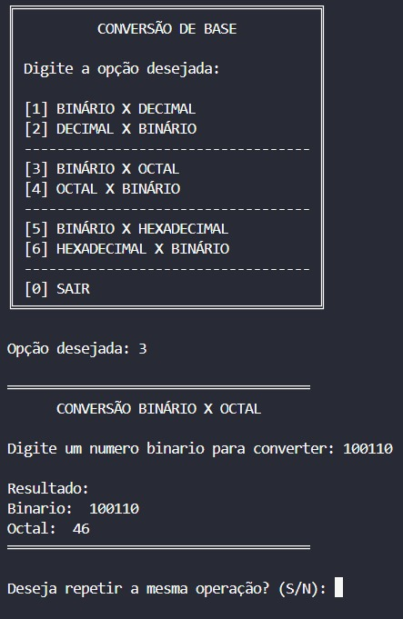
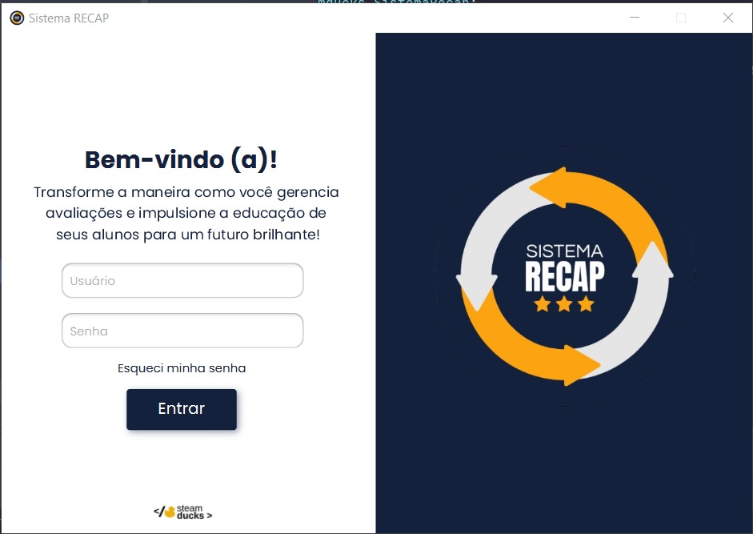
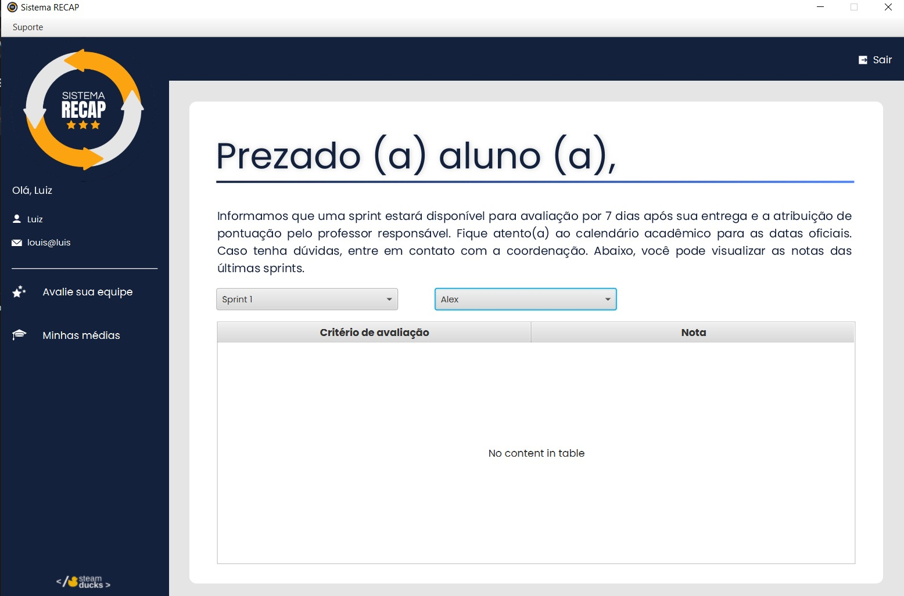
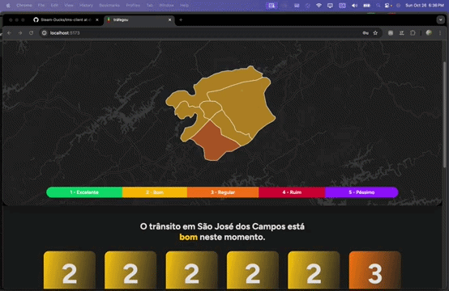

<p align="center">
  
</p>


<div style="margin-right: 220px;">

## Introdução

<div style="text-align: justify;">
Olá!
Meu nome é Isabelly, tenho 20 anos, sou estudante de Banco de Dados pela FATEC Jessen Vidal, de São José dos Campos, e atualmente estagiária de análise de dados na Ericsson.  

Minha trajetória na área de desenvolvimento começou no 1º semestre de 2024, e desde então venho adquirindo experiência nos diferentes campos que envolvem softwares estruturados. No meu dia a dia, é comum trabalhar com Python, Java, Docker e demais soluções de gerenciamento para armazenamento, consulta e organização de informações.  

Nos meus planos futuros, busco me aprofundar em back-end, criando sistemas eficientes, com código confiável o suficiente para sobreviver aos próximos releases; ou pelo menos até a próxima reunião de deploy. 
</div>

<div style="clear: both;"></div>

## Contato
* [LinkedIn](https://www.linkedin.com/in/isabelly-rdgs/)

## Meus Projetos

<details>
  <summary><strong>2024-1</strong></summary>

O projeto "Scientific Calculator" foi desenvolvido durante o 1º semestre do curso de Banco de Dados como uma calculadora de terminal com um amplo conjunto de operações matemáticas. O desenvolvimento foi dividido em quatro sprints: nas duas primeiras, as operações foram implementadas em VisualG; nas duas últimas, o código foi reescrito em TypeScript. O produto final oferecia operações básicas, fatorial, função de 2º grau, juros simples e compostos, conversão de bases numéricas e concatenação de strings — tudo via menu interativo no terminal.

<h1 align="center"> Scientific Calculator </h1>

<div align="center">
  
</div>
<br><br>

<p align="center">
  <a href="https://github.com/Steam-Ducks/scientific-calculator">
    
  </a>
</p>

<br><br>

#### Tecnologias Utilizadas

<div align="center">

[](https://skillicons.dev)


</div>

#### Contribuições Pessoais

Era o primeiro projeto do curso e o primeiro contato real com lógica de programação aplicada a um produto funcional. O desenvolvimento aconteceu em duas fases distintas: nas Sprints 1 e 2, todas as operações foram implementadas em VisualG — o que exigiu pensar em algoritmos puros, sem orientação a objetos ou bibliotecas, apenas estruturas de controle e variáveis. Nas Sprints 3 e 4, o código foi convertido para TypeScript, e a restrição do cliente se manteve: funções como `Math.pow` continuavam proibidas, e toda lógica de potenciação precisava ser construída do zero.

Fui responsável pela implementação da função de juros compostos nas duas fases. Em VisualG, modelei o algoritmo com as estruturas disponíveis na linguagem — variáveis tipadas, entrada de dados por `leia`, laço `para` para a potenciação acumulada e saída formatada com `escreva`. Na conversão para TypeScript, mantive a mesma lógica de potenciação manual via laço `for`, agora com tipagem estática, `prompt-sync` para entrada e `.toFixed(2)` para formatação monetária. A separação entre montante e juros foi preservada nas duas versões, garantindo consistência entre as entregas das fases.

O resultado foi uma implementação coerente do algoritmo nas duas linguagens — o que tornou a conversão mais do que uma tradução de sintaxe: foi um exercício de entender o que a lógica realmente fazia, independentemente da linguagem. Esse projeto foi onde aprendi que um algoritmo bem pensado não depende do ambiente em que roda.

<details>
  <summary>1. Função de Juros Compostos em TypeScript</summary>

A fórmula de juros compostos exige potenciação — mas o cliente havia restringido o uso de `Math.pow`, exigindo que a exponenciação fosse implementada manualmente nas duas fases do projeto. Em VisualG, o algoritmo foi modelado com um laço `para` que acumula o fator `(1 + i)` a cada período. Na conversão para TypeScript, a mesma lógica foi mantida com um laço `for`, agora com tipagem estática e formatação monetária. Ambas as versões separam o montante total dos juros isolados, entregando o resultado de forma clara para o usuário.

**`visualg/juros/jurosCompostos.alg` — versão original em VisualG (Sprints 1–2):**
```
Algoritmo "jurosCompostos"
Var
   capital, taxa, tempo, i, fator, potencia, montante, juros : Real
   k : Inteiro
Inicio
   Escreva("Insira o valor do Capital inicial: ")
   Leia(capital)
   Escreva("Insira a Taxa de Juros (%): ")
   Leia(taxa)
   Escreva("Escreva o tempo em meses: ")
   Leia(tempo)

   i <- taxa / 100
   fator <- 1 + i
   potencia <- 1

   Para k <- 1 ate tempo Faca
      potencia <- potencia * fator
   FimPara

   montante <- capital * potencia
   juros <- montante - capital

   Escreva("Montante final: R$ ", montante:0:2)
   Escreva("Total em Juros: R$ ", juros:0:2)
Fimalgoritmo
```

**`typeScript/src/compoundInterest.ts` — conversão para TypeScript (Sprints 3–4):**
```typescript
import promptSync from 'prompt-sync';

const prompt = promptSync();

export function compountInterest(): void {
    let montante: number;
    let capital: number;
    let taxa: number;
    let tempo: number;
    let i: number;
    let juros: number;

    capital = parseFloat(prompt("Insira o valor do Capital inicial: "));
    console.log("")
    taxa = parseFloat(prompt("Agora, insira a Taxa de Juros: "));
    console.log("")

    i = taxa / 100;
    tempo = parseFloat(prompt("Escreva o tempo em meses: "));
    console.log("")

    // potenciação manual — sem Math.pow, conforme restrição do cliente
    let fator = 1 + i;
    let potencia = 1;

    for (let k = 0; k < tempo; k++) {
        potencia *= fator;
    }

    montante = capital * potencia;
    juros = montante - capital;

    console.log("Seu Montante total final será: R$", montante.toFixed(2))
    console.log("Total em Juros:", " R$", juros.toFixed(2))
}
```

</details>

#### Hard Skills
* **VisualG:** modelagem de algoritmos com estruturas de controle, variáveis tipadas e entrada/saída via terminal;
* **TypeScript:** conversão e implementação de funções tipadas com lógica matemática e entrada de dados via `prompt-sync`;
* **Lógica de programação:** construção manual de potenciação sem uso de funções nativas, respeitando restrições do cliente em ambas as linguagens;
* **Git & GitHub:** versionamento com commits semânticos e boas práticas de nomenclatura em inglês;

#### Soft Skills
* **Atenção às Restrições do Projeto:** cumprimento da regra de não usar `Math.pow` nas duas fases, implementando a exponenciação de forma estruturada e compreensível em VisualG e TypeScript.
* **Consistência entre Implementações:** manutenção da mesma lógica algorítmica nas duas linguagens, garantindo que a conversão fosse fiel à versão original.
* **Precisão Matemática:** cuidado com a conversão da taxa percentual para decimal e com o isolamento correto do valor de juros em relação ao montante.

</details>


<details>
  <summary><strong>2024-2</strong></summary>

O projeto "PAS — Peer Assessment System" foi desenvolvido como uma aplicação desktop em JavaFX para apoiar o processo de avaliação acadêmica de alunos e equipes ao longo das sprints. O sistema oferece duas frentes principais: a avaliação individual de alunos por critérios (autonomia, prazo, colaboração e produtividade), com distribuição limitada de pontos entre os membros da equipe, e a avaliação coletiva de sprints, em que cada turma pode pontuar suas equipes em diferentes ciclos do projeto.

A aplicação foi pensada para garantir consistência nas avaliações: validações em tempo real impedem que o avaliador exceda o total de pontos disponíveis, popups exibem descrições contextuais de cada critério, e mensagens de erro orientam o usuário antes de qualquer salvamento. A interface foi construída com FXML, separando a camada visual da lógica de controle, e estruturada em layouts dinâmicos (VBox/HBox) que se adaptam à quantidade de critérios ou equipes carregadas, simulando o comportamento de uma tabela responsiva.

<h1 align="center"> PACER </h1>

<div align="center">
  
  
</div>
<br><br>

<p align="center">
  <a href="https://github.com/Steam-Ducks/pacer-assessment-system" target="_blank">
    
  </a>
</p>

<br><br>

#### Tecnologias Utilizadas

<div align="center">

[](https://skillicons.dev)

</div>

#### Contribuições Pessoais

O sistema precisava traduzir regras acadêmicas rígidas em comportamento de software: um avaliador não pode distribuir mais pontos do que o disponível, cada critério precisa de descrição acessível no momento do preenchimento, e as equipes carregadas devem corresponder exatamente à turma selecionada. Erros de usabilidade aqui impactariam diretamente a validade das avaliações. A responsabilidade de transformar esses requisitos em telas funcionais ficou comigo.

Construí as duas telas principais do sistema — a de avaliação individual de alunos e a de avaliação de sprints — com suas respectivas classes controller em Java e interfaces em FXML. Na tela de alunos, implementei um listener que monitora em tempo real cada alteração nos ComboBoxes: ao tentar distribuir mais pontos do que o saldo disponível, o campo é revertido automaticamente e um alerta é exibido antes que qualquer dado inválido seja salvo. Adicionei também popups modais com a descrição de cada critério, acessíveis diretamente da tela de preenchimento. Na tela de sprints, estruturei o carregamento dinâmico de equipes a partir da turma selecionada e a validação de notas no intervalo correto (1–100), com bloqueio de entrada fora dos limites. Modelei as classes de domínio `notaAluno` e `notaSprint`, e configurei o ambiente Maven com as dependências necessárias de JavaFX, ControlsFX e JUnit.

As telas foram entregues com validações completas e sem comportamentos inesperados diante de entradas fora do esperado. A separação clara entre FXML (layout) e controller (lógica) facilitou a manutenção do código ao longo das sprints, e a modelagem das entidades de avaliação estabeleceu uma base consistente para persistência futura. Aprendi nesse projeto a importância de pensar em componentes reutilizáveis e a traduzir regras de negócio em validações concretas que orientam — em vez de punir — o usuário.

<details>
  <summary>1. Tela de Avaliação de Aluno com distribuição limitada de pontos</summary>

O critério acadêmico exigia que o avaliador distribuísse exatamente 10 pontos entre os membros — nem mais, nem menos. Sem validação em tempo real, um avaliador poderia salvar notas inválidas sem perceber. Implementei um listener nos ComboBoxes que monitora cada alteração: ao exceder o saldo disponível, o campo é revertido automaticamente e um alerta é exibido antes que qualquer dado inválido seja salvo.

## Listener de pontos restantes

**`telaAlunoController.java` — controle dinâmico do total de pontos disponíveis:**
```java
comboBox.valueProperty().addListener((obs, oldValue, newValue) -> {
    int diff = newValue - oldValue;

    if (totalPontos - diff < 0) {
        Alert alert = new Alert(Alert.AlertType.ERROR);
        alert.setTitle("Erro");
        alert.setHeaderText("Pontos insuficientes");
        alert.setContentText("Você não tem pontos suficientes para esta ação.");
        alert.showAndWait();

        comboBox.setValue(oldValue);
        totalPontos -= diff;
        lbl_pontosRestantes.setText("Pontos restantes: " + totalPontos);
    } else {
        totalPontos -= diff;
        lbl_pontosRestantes.setText("Pontos restantes: " + totalPontos);
    }
});
```

**Popup com descrição contextual de cada critério:**
```java
private void mostrarPopupDescricao(String criterio, String descricao) {
    Stage popupStage = new Stage();
    popupStage.initModality(Modality.APPLICATION_MODAL);
    popupStage.setTitle("Descrição do Critério");

    Label lblCriterio = new Label("Critério: " + criterio);
    lblCriterio.setFont(new Font("Arial", 16));

    Label lblDescricao = new Label(descricao);
    lblDescricao.setWrapText(true);

    VBox vbox = new VBox(lblCriterio, lblDescricao);
    vbox.setSpacing(10);
    vbox.setPadding(new Insets(10));

    Scene scene = new Scene(vbox, 300, 150);
    popupStage.setScene(scene);
    popupStage.showAndWait();
}
```

</details>

<details>
  <summary>2. Tela de Avaliação de Sprint com equipes dinâmicas por turma</summary>

Cada turma tinha suas próprias equipes — exibir uma lista fixa seria incorreto e confuso para o avaliador. O carregamento das equipes foi feito de forma condicional a partir da turma selecionada no ComboBox, e cada campo de nota recebe validação em tempo real no intervalo de 1 a 100, bloqueando entradas fora do domínio antes que cheguem ao backend.

## Carregamento condicional de equipes

**`telaSprintController.java` — equipes filtradas a partir da turma selecionada:**
```java
private void atualizarEquipes(String turmaSelecionada) {
    List<String> equipes = switch (turmaSelecionada) {
        case "BD-1" -> List.of("Equipe A", "Equipe B", "Equipe C", "Equipe D", "Equipe E");
        case "BD-2" -> List.of("SteamDucks", "SQLutions", "DenariusData", "AlphaCode", "CyberNexus");
        case "BD-3" -> List.of("Equipe 1", "Equipe 2", "Equipe 3", "Equipe 4", "Equipe 5");
        case "BD-4" -> List.of("Equipe01", "Equipe02", "Equipe03", "Equipe04", "Equipe05");
        case "BD-5" -> List.of("Equipe_1", "Equipe_2", "Equipe_3", "Equipe_4", "Equipe_5");
        case "BD-6" -> List.of("Equipe I", "Equipe II", "Equipe III", "Equipe IV", "Equipe V");
        default -> List.of();
    };

    vbox_equipes.getChildren().clear();

    for (String equipe : equipes) {
        Label label = new Label(equipe);
        TextField textField = new TextField();
        textField.setPromptText("0");

        textField.textProperty().addListener((obs, oldValue, newValue) -> {
            if (!newValue.matches("\\d*") ||
                (newValue.length() > 0 && (Integer.parseInt(newValue) < 1 || Integer.parseInt(newValue) > 100))) {
                textField.setText(oldValue);
            }
        });

        HBox hbox = new HBox(new HBox(label), new HBox(textField));
        VBox.setMargin(hbox, new Insets(5, 70, 5, 60));
        vbox_equipes.getChildren().add(hbox);
    }
}
```

</details>

<details>
  <summary>3. Modelagem das classes de domínio</summary>

Sem classes de domínio bem definidas, as avaliações seriam representadas como valores soltos sem estrutura nem semântica — tornando difícil qualquer extensão futura, como persistência ou exportação de relatórios. `notaAluno` e `notaSprint` estabeleceram contratos claros para os dados do sistema, com todos os atributos necessários encapsulados e acessíveis de forma consistente.

## Entidades de avaliação

**`notaAluno.java` — representa uma nota individual atribuída a um aluno em um critério específico:**
```java
public class notaAluno {
    private int nota;
    private String aluno;
    private String criterio;
    private String descCriterio;
    private String sprint;

    public notaAluno(int nota, String aluno, String criterio, String descCriterio, String sprint) {
        this.nota = nota;
        this.aluno = aluno;
        this.criterio = criterio;
        this.descCriterio = descCriterio;
        this.sprint = sprint;
    }
    // getters e setters
}
```

**`notaSprint.java` — representa a nota atribuída a uma equipe em uma sprint:**
```java
public class notaSprint {
    private int nota;
    private String turma;
    private String equipe;
    private String sprint;

    public notaSprint(int nota, String turma, String equipe, String sprint) {
        this.nota = nota;
        this.turma = turma;
        this.equipe = equipe;
        this.sprint = sprint;
    }
    // getters e setters
}
```

</details>

<details>
  <summary>4. Configuração do ambiente Maven com JavaFX</summary>

O ambiente de desenvolvimento não estava configurado para rodar JavaFX, ControlsFX e JUnit juntos — o que impedia o time de executar e testar a aplicação localmente. A configuração do `pom.xml` com as dependências corretas e o `module-info.java` com os módulos necessários desbloqueou o ambiente de desenvolvimento e o ciclo de build, permitindo que o time avançasse nas funcionalidades sem impedimentos de infraestrutura.

## pom.xml

**Dependências e plugin do JavaFX para empacotamento da aplicação:**
```xml
<dependencies>
    <dependency>
        <groupId>org.openjfx</groupId>
        <artifactId>javafx-controls</artifactId>
        <version>22.0.1</version>
    </dependency>
    <dependency>
        <groupId>org.openjfx</groupId>
        <artifactId>javafx-fxml</artifactId>
        <version>22.0.1</version>
    </dependency>
    <dependency>
        <groupId>org.controlsfx</groupId>
        <artifactId>controlsfx</artifactId>
        <version>11.2.1</version>
    </dependency>
    <dependency>
        <groupId>org.junit.jupiter</groupId>
        <artifactId>junit-jupiter-api</artifactId>
        <version>${junit.version}</version>
        <scope>test</scope>
    </dependency>
</dependencies>
```

**`module-info.java` — declaração dos módulos requeridos pelo JavaFX:**
```java
module org.example.telaAvaliacaoAluno {
    requires javafx.controls;
    requires javafx.fxml;
    requires org.controlsfx.controls;

    opens org.example.telaAvaliacaoAluno to javafx.fxml;
    exports org.example.telaAvaliacaoAluno;
}
```

</details>

#### Hard Skills
* **Java & JavaFX:** desenvolvimento de aplicações desktop com interfaces ricas e responsivas;
* **FXML:** estruturação de telas declarativas e separação entre camada de visualização e lógica de controle;
* **Maven:** gerenciamento de dependências, configuração de plugins e empacotamento da aplicação com `javafx-maven-plugin`;
* **ControlsFX & JUnit:** uso de componentes complementares de UI e configuração base para testes unitários;
* **Git & GitHub:** versionamento de código e organização de commits incrementais por feature;

#### Soft Skills
* **Atenção a Regras de Negócio:** tradução de critérios acadêmicos em validações concretas (limite de pontos, faixas de nota, campos obrigatórios) que orientam o usuário durante o preenchimento.
* **Pensamento em Componentes:** estruturação das telas em layouts dinâmicos reutilizáveis (VBox/HBox) que se adaptam à quantidade de critérios e equipes carregados.
* **Cuidado com a Experiência do Usuário:** uso de popups, mensagens de erro contextuais e descrições de critérios para reduzir dúvidas no momento da avaliação.
* **Organização de Código:** separação clara entre Application, Controller e classes de domínio, mantendo cada responsabilidade isolada.

</details>


<details>
  <summary><strong>2025-1</strong></summary>

Em parceria com a empresa Altave, foi desenvolvido um sistema web para monitoramento de funcionários de empresas terceiras em áreas de manutenção. O sistema foi pensado a fim de permitir o cadastro de empresas e profissionais, incluindo fotos, e oferecendo uma filtragem de informações completa (por data, empresa e profissional). É possível visualização de dados de forma gráfica em um dashboard interativo, bem como extrair relatórios detalhados para análise de desempenho e controle de horas trabalhadas.

O projeto contou com uma API para consumo de dados e uma modelagem de banco de dados relacional eficiente, garantindo integridade e organização das informações. O design do front-end é minimalista e intuitivo, facilitando a navegação e o uso diário do sistema. Além disso, o sistema possui funcionalidades de gestão de acesso, permitindo que usuários se autentiquem por e-mail e senha, e registra um histórico de alterações realizadas nos pontos, assegurando transparência e controle das informações por meio de controle de acesso baseado em papéis (RBAC). Também há suporte à criação de cargos e definição de pagamentos com base nas horas trabalhadas, integrando todas as necessidades de monitoramento e gestão de funcionários terceirizados em um único ambiente digital.

<h1 align="center"> Pontual </h1>


<div align="center">
  
</div>
<br><br> 

<p align="center">
  <a href="https://github.com/Steam-Ducks/point-system" target="_blank">
    
  </a>
</p>

<br><br>

#### Tecnologias Utilizadas

<div align="center">
  
[](https://skillicons.dev)

</div>


#### Contribuições Pessoais

Era o primeiro projeto com um cliente real — a Altave — e o time enfrentava dois desafios simultâneos: entregar funcionalidades com qualidade técnica crescente e, ao mesmo tempo, manter o alinhamento humano de um grupo que ainda estava aprendendo a trabalhar junto. Sem processo estruturado, sprints viravam caos; sem cobertura técnica, integrações quebravam silenciosamente. Assumi o papel de Scrum Master com a responsabilidade de resolver os dois lados ao mesmo tempo.

No processo, conduzi todas as cerimônias do Scrum — dailies, plannings, reviews e retrospectivas — documentando cada reunião em atas formais e mantendo o histórico de decisões acessível ao time. O acompanhamento diário acontecia também via grupo do WhatsApp, onde registrei status de tarefas, alinhamentos emergentes, bloqueios reportados fora do horário de reunião e decisões rápidas que precisavam de registro. Isso criou uma trilha de comunicação rastreável que foi várias vezes consultada para esclarecer o que havia sido combinado. Na gestão de pessoas, acompanhei individualmente a carga de cada membro via Jira — identificando quem estava sobrecarregado, quem precisava de suporte técnico e quando redistribuir tarefas antes que o prazo da sprint fosse comprometido. No lado técnico, implementei testes unitários em Java com JUnit e Mockito para sete controllers do backend, configurei o banco H2 para testes locais e participei ativamente dos code reviews.

O projeto foi entregue no prazo com todas as funcionalidades acordadas. O processo de documentação e acompanhamento que estruturei tornou o time mais autônomo ao longo das sprints — as decisões passaram a ser consultadas, não refeitas, e os bloqueios eram resolvidos antes de virar atraso. Aprendi que gestão de pessoas em time de desenvolvimento não é sobre cobrar — é sobre criar as condições para que cada pessoa consiga entregar.

<details>
  <summary>📋 1. Atas de Reunião e Cerimônias Scrum</summary>

O time não tinha histórico documentado de decisões — o que foi combinado numa planning poderia ser questionado semanas depois, gerando retrabalho e conflito de expectativas. Passei a registrar formalmente cada cerimônia, com pauta, participantes, decisões tomadas e próximos passos com responsável e prazo. As atas ficavam disponíveis no repositório e eram linkadas no grupo do WhatsApp logo após cada reunião.

---

**Modelo de Ata — Planning Sprint 2:**

| Campo | Detalhe |
|---|---|
| **Data** | 25/03/2025 |
| **Participantes** | Isabelly (SM), PO, Dev 1, Dev 2, Dev 3, Dev 4 |
| **Sprint Goal** | Entrega do módulo de ponto com autenticação e dashboard básico |

**Itens do Backlog priorizados:**
| ID | Descrição | Responsável | Estimativa |
|---|---|---|---|
| US-07 | Autenticação por e-mail e senha | Dev 1 | 5 pts |
| US-08 | Registro de ponto de entrada/saída | Dev 2 | 8 pts |
| US-09 | Dashboard com filtro por data | Dev 3 | 5 pts |
| US-10 | Relatório de horas por funcionário | Dev 4 | 3 pts |

**Decisões tomadas:**
- US-10 depende de US-08 estar mergeada antes do meio da sprint
- Dailies mantidas às 19h via Discord
- Critério de aceite de US-09 validado com PO: filtro deve funcionar por data e empresa

**Próximos passos:**
- [ ] Dev 1 abre branch `feat/auth` até amanhã
- [ ] SM cria cards no Jira com as estimativas até 26/03

</details>

<details>
  <summary>💬 2. Gestão de Pessoas e Registro via WhatsApp</summary>

Em times de faculdade, a comunicação informal via WhatsApp é onde as coisas realmente acontecem — mas sem registro estruturado, decisões importantes se perdem no scroll. Padronizei o uso do grupo para que atualizações de tarefa, bloqueios e alinhamentos emergenciais fossem sempre registrados com contexto suficiente para rastrear depois. Isso também me permitia identificar quando alguém estava travado ou sobrecarregado antes da próxima daily.

---

**Exemplo de registros no grupo da equipe:**

> 🟡 **[BLOQUEIO]** Dev 2 — branch `feat/registro-ponto` com conflito em merge. Alguém disponível para pair agora? @Dev1
>
> ✅ **[RESOLVIDO]** Dev 1 e Dev 2 resolveram o conflito às 21h. Branch pronta para review.

---

> 📌 **[DECISÃO]** Alinhado com PO: filtro de dashboard por empresa vai para Sprint 3. US-09 entrega só o filtro por data nessa sprint.
>
> 📝 Registrado na ata da review. Jira atualizado.

---

> 📊 **[STATUS SPRINT 2 — dia 5/7]**
> - ✅ US-07 Autenticação — **concluída**, em review
> - 🔄 US-08 Registro de ponto — **em andamento** (70%)
> - 🔄 US-09 Dashboard — **em andamento** (40%)
> - ⚠️ US-10 Relatório — **não iniciada** — dependência de US-08
>
> Atenção: US-10 corre risco. Dev 4, podemos alinhar hoje?

</details>

<details>
  <summary>📊 3. Acompanhamento Individual e Gestão de Carga via Jira</summary>

Com cinco devs trabalhando em paralelo em sprints de duas semanas, era fácil que alguém ficasse sobrecarregado sem que o time percebesse — e que outro ficasse ocioso esperando uma dependência desbloquear. Acompanhei semanalmente a distribuição de pontos por membro no Jira, cruzando com o velocity de sprints anteriores para antecipar riscos de entrega antes que virassem problema real.

---

**Exemplo de distribuição acompanhada (Sprint 3):**

| Membro | Pontos alocados | Concluídos (dia 6/10) | Status |
|---|---|---|---|
| Dev 1 | 8 pts | 8 pts | ✅ Concluído |
| Dev 2 | 13 pts | 6 pts | ⚠️ Em risco |
| Dev 3 | 5 pts | 5 pts | ✅ Concluído |
| Dev 4 | 8 pts | 3 pts | ⚠️ Em risco |
| Dev 5 | 5 pts | 5 pts | ✅ Concluído |

> **Ação tomada:** redistribuí 3 pts de Dev 2 para Dev 3 (que havia concluído cedo) após alinhamento individual. Sprint entregue sem pendências.

</details>

<details>
  <summary>1. Configuração de Dependências</summary>

O projeto não tinha ambiente de testes isolado — qualquer teste rodaria contra o banco de produção ou simplesmente não rodaria. Configurei o banco H2 em memória com um profile `test` separado, garantindo que os testes fossem rápidos, reproduzíveis e sem efeito colateral no banco real. Isso foi o pré-requisito para tudo que veio depois na cobertura do backend.

  ## H2 

**pom.xml:**
```     <scope>runtime</scope>
      <optional>true</optional>
    </dependency>
    <dependency>
      <groupId>com.h2database</groupId>
      <artifactId>h2</artifactId>
      <version>2.2.224</version>
      <scope>runtime</scope>
    </dependency>
    <dependency>
      <groupId>org.projectlombok</groupId>
      <artifactId>lombok</artifactId>
```


**point-system/src/test/java/pointsystem/integrationPointSystemApplicationTests.java:**
```
package pointsystem.integration;

import org.junit.jupiter.api.Test;
import org.springframework.boot.test.autoconfigure.orm.jpa.DataJpaTest;
import org.springframework.boot.test.context.SpringBootTest;
import org.springframework.test.context.ActiveProfiles;

@DataJpaTest
@ActiveProfiles("test")
@SpringBootTest
class PointSystemApplicationTests {
```

**point-system/src/test/resources/application-test.properties:**
```
# Habilita o console web do H2
spring.h2.console.enabled=true
spring.h2.console.path=/h2-console

# Configuração do datasource para H2
spring.datasource.url=jdbc:h2:mem:pointdb
spring.datasource.driverClassName=org.h2.Driver
spring.datasource.username=sa
spring.datasource.password=

# JPA (opcional, ajusta conforme sua necessidade)
spring.jpa.database-platform=org.hibernate.dialect.H2Dialect
spring.jpa.hibernate.ddl-auto=update
```

</details>

<details>
  <summary>2. Testes</summary>

As controllers não tinham cobertura alguma — falhas de lógica nos retornos da API só seriam descobertas em tempo de execução, muitas vezes pelo cliente. Escrevi testes com JUnit e Mockito para os sete controllers do sistema, cobrindo os cenários de sucesso, erro de validação e erro interno para cada endpoint. Com isso, integrações passaram a ser validadas antes de chegar à branch principal.

  ## Exemplo de Testes de Unidade

```
package pointsystem.unit.controller;

import org.junit.jupiter.api.BeforeEach;
import org.junit.jupiter.api.Test;
import org.mockito.*;
import org.springframework.http.HttpStatus;
import org.springframework.http.ResponseEntity;
import pointsystem.controller.UserController;
import pointsystem.dto.user.UserDto;
import pointsystem.service.UserService;

import java.util.Arrays;
import java.util.List;
import java.util.Map;

import static org.junit.jupiter.api.Assertions.*;
import static org.mockito.Mockito.*;

class UserControllerTest {

    @InjectMocks
    private UserController userController;

    @Mock
    private UserService userService;

    private AutoCloseable mocks;

    @BeforeEach
    void setUp() {
        mocks = MockitoAnnotations.openMocks(this);
    }

    @Test
    void testCreateUserSuccess() {
        UserDto dto = new UserDto();
        when(userService.createUser(dto)).thenReturn(10);

        ResponseEntity<?> response = userController.createUser(dto);

        assertEquals(HttpStatus.CREATED, response.getStatusCode());
        assertEquals(Map.of("id", 10), response.getBody());
        verify(userService).createUser(dto);
    }

    @Test
    void testCreateUserBadRequest() {
        UserDto dto = new UserDto();
        when(userService.createUser(dto)).thenThrow(new IllegalArgumentException("Dados inválidos"));

        ResponseEntity<?> response = userController.createUser(dto);

        assertEquals(HttpStatus.BAD_REQUEST, response.getStatusCode());
        assertEquals(Map.of("message", "Dados inválidos"), response.getBody());
    }

    @Test
    void testCreateUserInternalServerError() {
        UserDto dto = new UserDto();
        when(userService.createUser(dto)).thenThrow(new RuntimeException());

        ResponseEntity<?> response = userController.createUser(dto);

        assertEquals(HttpStatus.INTERNAL_SERVER_ERROR, response.getStatusCode());
        assertEquals(Map.of("message", "Erro ao cadastrar o Usuario. tente novamente"), response.getBody());
    }

    @Test
    void testGetAllUsers() {
        List<UserDto> users = Arrays.asList(new UserDto(), new UserDto());
        when(userService.getAllUsers()).thenReturn(users);

        ResponseEntity<List<UserDto>> response = userController.getAllUsers();

        assertEquals(HttpStatus.OK, response.getStatusCode());
        assertEquals(users, response.getBody());
    }

    @Test
    void testGetUserByIdFound() {
        UserDto user = new UserDto();
        when(userService.getUserById(1)).thenReturn(user);

        ResponseEntity<UserDto> response = userController.getUserById(1);

        assertEquals(HttpStatus.OK, response.getStatusCode());
        assertEquals(user, response.getBody());
    }

    @Test
    void testGetUserByIdNotFound() {
        when(userService.getUserById(1)).thenReturn(null);

        ResponseEntity<UserDto> response = userController.getUserById(1);

        assertEquals(HttpStatus.NOT_FOUND, response.getStatusCode());
        assertNull(response.getBody());
    }

    @Test
    void testUpdateUser() {
        UserDto dto = new UserDto();

        ResponseEntity<Void> response = userController.updateUser(1, dto);

        assertEquals(HttpStatus.NO_CONTENT, response.getStatusCode());
        verify(userService).updateUserById(1, dto);
    }
}
```
</details>


#### Hard Skills
* **Java & Spring Boot:** desenvolvimento de controllers, serviços e integração com banco de dados;

* **JUnit & Testes Unitários/Integração:** criação de testes abrangentes para múltiplos módulos do backend;

* **Git & GitHub:** gerenciamento de branches, merges, pull requests e manutenção de repositório; 

* **Banco de dados H2:** configuração para testes locais;

* **Jira:** acompanhamento de produtividade, tarefas e gerenciamento de sprints; 

#### Soft Skills
* **Liderança e Coordenação de Equipe:** condução de reuniões diárias e alinhamento de prioridades, garantindo o progresso do projeto.

* **Comunicação Eficaz:** interface constante com Product Owner e stakeholders para definir expectativas e esclarecer requisitos.

* **Organização e Planejamento:** manutenção de roteiro, documentação e estrutura de repositório organizada.

* **Resolução de Problemas:** identificação de impedimentos e proposição de soluções ágeis para manter o ritmo de desenvolvimento.

</details>

<details>
  <summary><strong>2025-2</strong></summary>

O projeto "Tráfegou! – Monitoramento de Tráfego Inteligente" foi desenvolvido com o objetivo de atender a uma demanda real da Prefeitura de São José dos Campos. 

A plataforma consolida o mapa georreferenciado com indicadores relevantes, classifica regiões por níveis de criticidade e automatiza o disparo de alertas vinculados (com integração ao bot do Telegram) a protocolos de ação previamente definidos. A aplicação permite não apenas identificar problemas, mas também registrar ações tomadas pelos gestores, criando um histórico rastreável e estratégico para melhoria contínua da mobilidade urbana afim de agir de forma ágil diante de mudanças no cenário do trânsito.

<h1 align="center"> Tráfegou </h1>

<div align="center">
  <table>
    <tr>
      <td>
  </table>
</div>


<p align="center">
  <a href="https://github.com/Steam-Ducks/traffic-monitoring-system" target="_blank">
    
  </a>
</p>

<br><br>

#### Tecnologias Utilizadas

<div align="center">

[](https://skillicons.dev)


</div>

#### Contribuições Pessoais

O sistema de monitoramento de tráfego precisava ir além de mostrar um mapa: ele deveria comunicar o estado da cidade de forma imediata e indicar, em tempo real, quais vias estavam com as piores condições de fluxo. O desafio estava em definir quais métricas fariam sentido para esse contexto e, depois, construir os componentes capazes de exibi-las de forma clara e responsiva. Essa responsabilidade — da decisão sobre os indicadores até a entrega visual — ficou sob minha condução.

Participei ativamente das discussões sobre quais dados agregariam valor ao sistema e estruturei os componentes visuais da interface a partir dessas decisões. Desenvolvi o módulo de alertas de vias críticas: um sidebar reativo (`TrafficAlertsSidebar.vue`) que consome um endpoint agendado e exibe, em tempo real, a rua com pior condição por região, classificada por nível de severidade calculado a partir da diferença entre velocidade limite e velocidade média. No backend, implementei o endpoint `GET /worst` em Java com Spring Boot e a lógica de ranqueamento por severidade no `LevelService`. Criei também o composable `useTrafficStatus`, que mantém o estado global de qualidade do trânsito compartilhado entre o dashboard e o mapa, com cores e textos dinâmicos por nível. Para complementar a análise, construí os gráficos de desempenho diário por hora (`LineChart`) e comparação semanal de velocidade (`DoubleBarChart`), garantindo que o design projetado no Figma fosse fielmente reproduzido na aplicação final.

O resultado foi uma interface que comunicava o estado do tráfego da cidade em uma única tela: status global em destaque, alertas por região ao lado do mapa e gráficos históricos integrados. Esse projeto consolidou minha capacidade de atuar nas duas pontas do sistema simultaneamente e de participar de decisões de produto com embasamento técnico — sabendo o que é viável entregar e o que agrega valor real para o usuário final.

<details>
<summary>1. Sidebar de alertas com integração ao endpoint de piores ruas</summary>

<br>

Os gestores precisavam saber, em tempo real, quais ruas estavam com as piores condições — sem precisar vasculhar o mapa inteiro. O sidebar consome o endpoint `/worst` e exibe automaticamente a rua crítica por região, classificada pela diferença entre velocidade limite e velocidade média, com níveis visuais de urgência e transição animada. O backend calcula a severidade e retorna apenas uma rua por região, mantendo a resposta enxuta e o frontend reativo.

**`TrafficAlertsSidebar.vue` — componente reativo com transição e níveis de severidade:**
```vue
<transition name="slide-fade">
  <aside class="sidebar" v-if="isOpen">
    <div v-for="alert in props.alerts" :key="alert.id"
         class="notification-card" :class="alert.level">
      <h4>{{ alert.region }}: {{ alert.street }}</h4>
      <p>{{ alert.statusText }}</p>
      <small>{{ alert.time }}</small>
    </div>
  </aside>
</transition>
```

**`StreetController.java` — endpoint que alimenta os alertas:**
```java
@GetMapping("/worst")
public ResponseEntity<List<WorstStreetByRegionDTO>> getWorstStreets() {
    return ResponseEntity.ok(levelService.getWorstStreetsByRegion());
}
```

**Lógica de severidade por rua (`LevelService.java`):**
```java
double severity = speedLimit != null ? (speedLimit - avgSpeed) : 0.0;
// retorna apenas a pior rua por região
return streets.stream()
    .max(Comparator.comparingDouble(WorstStreetByRegionDTO::getSeverity))
    .orElse(null);
```

</details>

<details>
<summary>2. Composable de status global da cidade</summary>

<br>

O status global do trânsito precisava ser consistente entre o dashboard principal e o mapa — qualquer dessincronização entre os dois exibia informações conflitantes para o usuário. O composable `useTrafficStatus` centraliza esse estado em um único lugar com reatividade nativa do Vue, garantindo que qualquer componente que consuma o nível exiba sempre o mesmo texto e cor.

**`useTrafficStatus.ts` — estado global reativo compartilhado entre dashboard e mapa:**
```ts
const statusMap: Record<Level, { text: string; color: string }> = {
  1: { text: "excelente", color: "#00A651" },
  2: { text: "bom",       color: "#FFC000" },
  3: { text: "regular",   color: "#FF7B00" },
  4: { text: "ruim",      color: "#D91532" },
  5: { text: "péssimo",   color: "#a005ff" }
}

const status = computed(() => statusMap[level.value])

export function useLevelStatus() {
  return { level, status, setLevel: (newLevel: Level) => (level.value = newLevel) }
}
```

**Consumido na view para exibição dinâmica:**
```vue
<h1>O trânsito em São José dos Campos está
  <b :style="{ color: status.color }">{{ status.text }}</b> neste momento.
</h1>
```

</details>

<details>
<summary> 3. Gráficos de métricas — decisão e implementação</summary>

<br>

A plataforma precisava de análise temporal do tráfego, mas não havia uma definição clara de quais cortes de tempo agregariam mais valor. Participei das discussões sobre os indicadores e implementei dois recortes complementares: comparação de velocidade entre semanas (DoubleBarChart) e distribuição por hora do dia (LineChart) — ambos integrados ao sistema de filtros existente e fiéis ao design do Figma.

**`DoubleBarChart.vue` — comparação de velocidade semanal:**
```ts
const weeklySpeedData = {
  labels: ['domingo', 'segunda', 'terça', 'quarta', 'quinta', 'sexta', 'sábado'],
  datasets: [
    { label: 'Semana 1', backgroundColor: '#1174e6', data: [1, 2, 3, 4, 5, 7, 9] },
    { label: 'Semana 2', backgroundColor: '#E15759', data: [3, 5, 8, 7, 4, 5, 6] },
  ],
}
```

**`LineChart` — desempenho por hora do dia (24h):**
```ts
labels: Array.from({ length: 24 }, (_, i) => `${i}h`),
datasets: [{
  label: 'Velocidade Média',
  borderColor: '#1174e6',
  backgroundColor: 'rgba(17, 116, 230, 0.2)',
  fill: true,
  data: [10, 12, 15, 20, 35, 45, 50, 25, 20, 28, 35, 40, ...]
}]
```

</details>

#### Hard Skills
* **Vue.js 3 & TypeScript:** desenvolvimento de componentes reativos, composables e integração com serviços;
* **Java & Spring Boot:** implementação de endpoints REST e lógica de negócio no backend;
* **Chart.js & vue-chartjs:** construção e customização de gráficos de métricas;
* **Docker:** configuração de ambiente e containerização da aplicação;

#### Soft Skills
* **Visão de Produto:** participação ativa nas decisões sobre quais métricas e indicadores agregar ao sistema.
* **Atenção a Detalhes:** fidelidade na implementação do design planejado no Figma e sugestão de melhorias responsivas, UI/UX.
* **Colaboração Técnica:** integração consistente entre camadas da aplicação em conjunto com o time, e contribuí na construção da API incluindo suporte à configuração do ambiente de banco de dados em nuvem e ao pipeline de coleta de dados via scheduled tasks na Oracle Cloud/sql developer.


</details>

<details>
  <summary><strong>2026-1</strong></summary>

Em parceria com a empresa Ericsson, foi desenvolvido o SCA — um sistema web de controle e análise de custos e materiais para projetos e programas internos. A plataforma foi construída com uma arquitetura de dados em camadas (silver/gold), permitindo a ingestão de dados via CSV, o monitoramento das execuções de importação e a visualização de indicadores financeiros em dashboards interativos.

O sistema consolida rankings de materiais por impacto financeiro, custos por projeto, composição de orçamento e histórico de execuções. Um módulo de auditoria dedicado exibe falhas e inconsistências nas importações, com paginação e filtros, além de um histórico completo das operações realizadas. O backend foi construído com Python e Django REST Framework, seguindo o ciclo TDD (Red → Green → Refactor), e o frontend com Vue.js 3 e TypeScript.

<h1 align="center"> SCA </h1>

<p align="center">
  <a href="https://github.com/Steam-Ducks/sca-server" target="_blank">
    
  </a>
  <a href="https://github.com/Steam-Ducks/sca-client" target="_blank">
    
  </a>
</p>

<br><br>

#### Tecnologias Utilizadas

<div align="center">

[](https://skillicons.dev)

</div>

#### Contribuições Pessoais

O sistema precisava de uma camada completa de ingestão e rastreabilidade de dados — e nenhuma delas existia ainda. Não havia como importar CSVs, registrar o resultado dessas importações, nem consultar o histórico de falhas. Ao mesmo tempo, o dashboard financeiro carecia de filtros por período e rankings de materiais que o time ainda precisaria construir do zero, tanto no backend quanto no frontend. Assumi a entrega dessas funcionalidades de ponta a ponta, atuando em paralelo nos dois repositórios — sca-server e sca-client — e sendo responsável por todo o ciclo: modelagem, implementação, testes e integração.

No backend, implementei os filtros de período do dashboard principal com queries dinâmicas usando `Q()` objects do Django ORM, e construí os dois rankings de materiais: o de maior impacto financeiro (`get_top_materials_by_financial_impact`) e o de custo por projeto (`CostByProjectView`), com serializers que formatam os valores monetários corretamente. Em seguida, criei o módulo `imports/` do zero: defini os schemas de colunas obrigatórias para os 11 tipos de CSV aceitos pelo sistema, implementei as funções de validação de linhas (`_validate_rows`, que distingue erros de avisos) e de registro de execução (`_register_execucao`), estruturei os endpoints de upload e cobri toda a camada com testes unitários (schemas, URLs e views). Depois, construí inteiramente o módulo `monitoring/`: selectors com filtros encadeados por status, tabela, fonte e período, serializer com o campo computado `duracao_segundos` e exposição de `tipo_processo`, views com passagem correta de parâmetros, e uma suite de 88 testes unitários cobrindo todos os campos e casos limite do serializer. Também participei de PRs co-autorados na centralização das constantes de schema do banco e na criação de fixtures de teste compartilhadas entre módulos. No frontend, integrei as novas APIs ao painel de gestão de materiais — implementando `fetchTopMaterials` e `fetchCostByProject` em TypeScript com tratamento de erros e cobertura de testes — e construí as três abas da tela de Auditoria: upload de CSV por tipo de dado, aba de Falhas e Inconsistências com paginação e aba de histórico de execuções, além de adicionar a rota `/auditoria` ao router com testes de resolução.

Ao final do semestre, dois módulos completos de backend haviam sido entregues do zero com cobertura de testes robusta, os dashboards financeiros passaram a suportar filtragem por período e exibição de rankings, e a tela de auditoria reunia em um único lugar todas as informações necessárias para rastrear e diagnosticar o ciclo de importação de dados. Esse projeto marcou uma virada na minha forma de trabalhar: pela primeira vez atuei em arquitetura de dados em camadas, adotei TDD como prática efetiva de desenvolvimento e conduzi entregas full stack com autonomia real — da modelagem do banco ao componente Vue que o usuário enxerga.

<details>
<summary>1. Filtros de período no dashboard principal (backend)</summary>

<br>

O dashboard exibia todos os projetos sem recorte temporal, tornando inviável comparar períodos ou analisar tendências. A função `get_projects_by_period` introduziu filtros opcionais de data usando `Q()` objects do Django ORM — sem quebrar queries que não usam o filtro — e o endpoint passou a aceitar `start_date` e `end_date` via query params, com teste de integração cobrindo o fluxo completo.

**`main_dashboard/selectors.py` — consulta com filtro dinâmico por data:**
```python
from django.db.models import Q
from sca_data.models import SilverProjeto


def get_projects_by_period(start_date=None, end_date=None):
    """
    Filter projects by a given date range using silver_ingested_at.
    """
    date_filter = Q()

    if start_date:
        date_filter &= Q(silver_ingested_at__date__gte=start_date)

    if end_date:
        date_filter &= Q(silver_ingested_at__date__lte=end_date)

    return SilverProjeto.objects.filter(date_filter)
```

**`main_dashboard/tests/test_views.py` — teste de integração do endpoint:**
```python
@pytest.mark.django_db
@patch("main_dashboard.views.get_projects_by_period")
def test_main_dashboard_endpoint_filters_by_period(mock_selector):
    client = APIClient()
    mock_selector.return_value = []

    response = client.get(
        "/api/main-dashboard/?start_date=2026-01-01&end_date=2026-12-31"
    )

    assert response.status_code == 200
    assert response.data == []
```

</details>

<details>
<summary>2. Rankings de materiais — impacto financeiro e custo por projeto (backend)</summary>

<br>

O sistema acumulava dados de compras e materiais, mas nenhuma view os agregava para revelar padrões de custo — não havia como saber quais materiais pesavam mais no orçamento ou em qual projeto os gastos eram maiores. Os dois rankings transformam dados brutos em indicadores acionáveis: o de impacto financeiro agrupa por descrição de material e ordena pelo custo total, enquanto o de custo por projeto alimenta diretamente o gráfico comparativo no frontend — ambos com formatação monetária e filtros repassáveis via query params.

**`materials/selectors.py` — ranking dos materiais com maior impacto financeiro:**
```python
def get_top_materials_by_financial_impact(params, limit=10):
    base_qs = get_materials_queryset(params)

    return (
        base_qs.values("solicitacao__material__descricao")
        .annotate(
            material=F("solicitacao__material__descricao"),
            total_cost=Sum("valor_total"),
        )
        .values("material", "total_cost")
        .order_by("-total_cost")[:limit]
    )
```

**`materials/serializers.py` — serializer com formatação de custo:**
```python
class TopMaterialsSerializer(serializers.Serializer):
    material = serializers.CharField()
    total_cost = serializers.SerializerMethodField()

    def get_total_cost(self, obj):
        value = obj.get("total_cost") or 0
        return round(float(value), 2)
```

**`materials/views.py` — endpoint de custo por projeto:**
```python
class CostByProjectView(APIView):
    """
    Retorna o custo total de materiais por projeto (ranking).
    """

    def get(self, request):
        data = get_cost_by_project(request.query_params)
        return Response(data)
```

</details>

<details>
<summary>3. Módulo de importação CSV — criação completa (backend)</summary>

<br>

Os dados do sistema chegavam exclusivamente via CSV, mas não existia nenhum mecanismo de ingestão — cada carga era manual e sem rastreabilidade. Criei o módulo `imports/` do zero: schemas com colunas obrigatórias para 11 tipos de entidade, validação linha a linha que distingue erros (nulos e vazios) de avisos (espaços em branco), registro persistente de cada execução com timestamps, e 100+ testes cobrindo schemas, URLs e fluxos de upload — incluindo mocks de dependências de banco para rodar sem ambiente externo.

**`imports/schemas.py` — definição dos 11 tipos de CSV aceitos e suas colunas obrigatórias:**
```python
REQUIRED_COLUMNS: dict[str, set[str]] = {
    "programas": {
        "id", "codigo_programa", "nome_programa", "gerente_programa",
        "gerente_tecnico", "data_inicio", "data_fim_prevista", "status",
    },
    "projetos": {
        "id", "codigo_projeto", "nome_projeto", "programa_id",
        "responsavel", "custo_hora", "data_inicio", "data_fim_prevista", "status",
    },
    "materiais": {
        "id", "codigo_material", "descricao", "categoria",
        "fabricante", "custo_estimado", "status",
    },
    # ... + 8 tipos adicionais (empenho_materiais, estoque, fornecedores,
    #     pedidos_compra, solicitacoes_compra, compras_projeto,
    #     tarefas_projeto, tempo_tarefas)
}
```

**`imports/views.py` — validação de linhas e registro de execução:**
```python
def _validate_rows(df):
    """Count error and warning rows in the dataframe."""
    erros = int(df.isnull().any(axis=1).sum() + (df == "").any(axis=1).sum())
    avisos = int(
        df.apply(lambda col: col.str.strip().eq("") & col.ne(""), axis=0)
        .any(axis=1)
        .sum()
    )
    return erros, avisos


def _register_execucao(
    run_id, tabela, status, linhas, erros, avisos, detalhes, iniciado_em
):
    try:
        FatoExecucaoCarga.objects.create(
            run_id=run_id,
            fonte="csv_upload",
            tabela=tabela,
            status=status,
            linhas_processadas=linhas,
            erros=erros,
            avisos=avisos,
            detalhes_falha=detalhes,
            iniciado_em=iniciado_em,
            finalizado_em=datetime.datetime.now(),
        )
    except Exception:
        logger.exception("Failed to register execucao_carga for %s", tabela)
```

</details>

<details>
<summary>4. Módulo de monitoramento e histórico de execuções (backend)</summary>

<br>

Após o módulo de imports existir, não havia como saber se uma importação havia funcionado, falhado ou levado muito tempo — a saúde do pipeline era completamente opaca. Criei o módulo `monitoring/` do zero: selectors com filtros encadeados por status, tabela, fonte e período; serializer com `duracao_segundos` computado a partir dos timestamps e `tipo_processo` exposto; e 88 testes unitários cobrindo todos os campos, casos limite e combinações de filtro — incluindo duração nula, duração zero e garantia de que todos os campos esperados estão presentes na resposta.

**`monitoring/selectors.py` — consulta com filtros por status, tabela, fonte e período:**
```python
def get_execucoes_carga(
    status=None, data_inicio=None, data_fim=None, tabela=None, fonte=None
):
    qs = FatoExecucaoCarga.objects.all()
    if status:
        qs = qs.filter(status=status)
    if tabela:
        qs = qs.filter(tabela=tabela)
    if fonte:
        qs = qs.filter(fonte=fonte)
    if data_inicio:
        if isinstance(data_inicio, str):
            data_inicio = datetime.date.fromisoformat(data_inicio)
        qs = qs.filter(iniciado_em__date__gte=data_inicio)
    if data_fim:
        if isinstance(data_fim, str):
            data_fim = datetime.date.fromisoformat(data_fim)
        qs = qs.filter(iniciado_em__date__lte=data_fim)
    return qs.order_by("-iniciado_em")
```

**`monitoring/serializers.py` — campo computado `duracao_segundos` e `tipo_processo`:**
```python
class FatoExecucaoCargaSerializer(serializers.ModelSerializer):
    duracao_segundos = serializers.SerializerMethodField()

    class Meta:
        model = FatoExecucaoCarga
        fields = [
            "id", "run_id", "fonte", "tabela", "tipo_processo",
            "status", "linhas_processadas", "erros", "avisos",
            "duracao_segundos", "detalhes_falha", "iniciado_em", "finalizado_em",
        ]

    def get_duracao_segundos(self, obj):
        if obj.finalizado_em and obj.iniciado_em:
            return int((obj.finalizado_em - obj.iniciado_em).total_seconds())
        return None
```

**`monitoring/tests/test_serializers.py` — suite de testes unitários do serializer:**
```python
def test_duracao_segundos_calculated_correctly():
    obj = _execucao(
        iniciado_em=datetime.datetime(2025, 1, 1, 10, 0, 0),
        finalizado_em=datetime.datetime(2025, 1, 1, 10, 0, 42),
    )
    assert FatoExecucaoCargaSerializer(obj).data["duracao_segundos"] == 42


def test_duracao_segundos_none_when_finalizado_em_null():
    obj = _execucao(finalizado_em=None)
    assert FatoExecucaoCargaSerializer(obj).data["duracao_segundos"] is None


def test_all_expected_fields_present():
    data = FatoExecucaoCargaSerializer(_execucao()).data
    expected = {
        "id", "run_id", "fonte", "tabela", "tipo_processo", "status",
        "linhas_processadas", "erros", "avisos", "duracao_segundos",
        "detalhes_falha", "iniciado_em", "finalizado_em",
    }
    assert expected == set(data.keys())
```

</details>

<details>
<summary>5. Integração dos rankings no frontend (sca-client)</summary>

<br>

As APIs de rankings existiam no backend, mas a interface ainda não as consumia — o painel de gestão de materiais mostrava dados tabelados sem nenhuma visão de custo agregado. Implementei `fetchTopMaterials` e `fetchCostByProject` em TypeScript com tipagem forte, passagem de filtros via query params e tratamento explícito de erros, com cobertura de testes unitários para sucesso, falha de rede e resposta não-ok da API.

**`src/services/materiaisService.ts` — serviço com fetchTopMaterials e fetchCostByProject:**
```typescript
export interface TopMaterial {
  material: string;
  total_cost: number;
}

export interface CostByProject {
  projeto: string;
  total_cost: number;
}

const materiaisService = {
  async fetchTopMaterials(filters: Filters): Promise<TopMaterial[]> {
    const qs = buildQueryParams(filters);
    const response = await fetch(`${CONFIG.API_BASE_URL}/top-materials/${qs}`);

    if (!response.ok) {
      throw new Error("Não foi possível carregar o ranking de materiais.");
    }
    return response.json() as Promise<TopMaterial[]>;
  },

  async fetchCostByProject(filters: Filters): Promise<CostByProject[]> {
    const qs = buildQueryParams(filters);
    const response = await fetch(`${CONFIG.API_BASE_URL}/cost-by-project/${qs}`);

    if (!response.ok) {
      throw new Error("Não foi possível carregar o custo por projeto.");
    }
    return response.json() as Promise<CostByProject[]>;
  },
};
```

</details>

<details>
<summary>6. Tela de Auditoria — CSV import, falhas e histórico (frontend)</summary>

<br>

O acompanhamento de importações estava totalmente invisível para o usuário — não havia onde disparar novos uploads, ver falhas ou consultar o histórico de operações. A tela de Auditoria reuniu as três necessidades em abas dedicadas: upload por tipo de CSV (US40), listagem de falhas e inconsistências com paginação (US31) e histórico de execuções com carregamento reativo (US33). Cada aba foi entregue com testes unitários cobrindo estados de loading, erros de API e comportamento reativo.

**`src/views/Auditoria.vue` — abas implementadas:**
- **US40 (SCA-345):** Criação dos componentes de upload de CSV para cada tipo de dado (programas, projetos, materiais etc.) dentro da tela de auditoria, com testes unitários cobrindo estados desabilitados e respostas não-ok da API.
- **US31 (SCA-338):** Implementação da aba "Falhas e Inconsistências" com paginação, exibindo os registros de execução com erro/aviso; adição da rota `/auditoria` ao router e expansão da suite de testes.
- **US33 (SCA-340):** Adição da aba de histórico de execuções, com carregamento reativo dos dados e testes associados.

**`src/router/index.ts` — rota da auditoria adicionada:**
```typescript
expect(routes[6].path).toBe("/auditoria");
expect(routes[6].name).toBe("auditoria");
```

</details>

#### Hard Skills
* **Python & Django REST Framework:** implementação de endpoints REST, selectors, serializers, migrations e lógica de negócio seguindo TDD com Pytest;
* **Vue.js 3 & TypeScript:** desenvolvimento de componentes reativos, serviços de integração com API e composables;
* **Pytest & Vitest:** criação de suites de testes unitários e de integração para backend e frontend, com mocks e fixtures compartilhadas;
* **Docker:** configuração de ambiente de desenvolvimento containerizado (docker-compose);
* **PostgreSQL (schema silver/gold):** consultas SQL com filtros dinâmicos, agregações e joins em arquitetura de dados em camadas;
* **SonarCloud:** análise e correção de issues de qualidade de código (lint, format, cobertura);
* **Git & GitHub:** gestão de branches, pull requests e commits semânticos (feat/fix/test);

#### Soft Skills
* **Autonomia e Entrega:** condução completa de módulos do zero — desde a concepção da estrutura até os testes e a integração — com responsabilidade sobre cada etapa do ciclo de desenvolvimento.
* **Pensamento em Camadas:** compreensão da arquitetura full stack ao integrar dados do backend aos componentes visuais do frontend, mantendo consistência entre as camadas.
* **Qualidade e Cobertura:** atenção à completude dos testes, cobrindo casos limite (campos nulos, filtros ausentes, respostas não-ok) além do caminho feliz.
* **Colaboração Técnica:** participação em PRs co-autorados (centralização de constantes de schema e fixtures de teste), contribuindo com revisão e integração de código em conjunto com o time.

</details>
